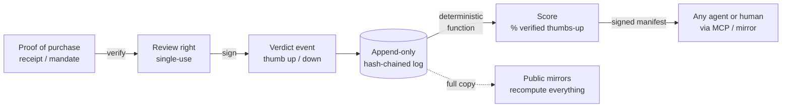

# Audience Score

**One receipt, one thumb, zero pay-to-play.**

[](https://github.com/audiencescore/audiencescore/actions/workflows/ci.yml)
[](LICENSE)
[](LICENSE-CC-BY-4.0)
[](data-commons/LICENSE-ODbL)

An open protocol for reputation you can verify instead of trust. The only way
to leave a verdict on a vendor is to cryptographically prove you actually
bought the thing, every verdict is a single binary — would you use them
again? — and the published score is nothing more than the percentage of
verified thumbs-up. Anyone can recompute any score from the public event
log. No one can buy a better one, because there is no ranking to sell:
the score is a deterministic function over signed events.

Fake reviews are an arms race that detection keeps losing. This protocol
takes the other path: don't detect fakes downstream, require proof of
authenticity at the source. A verdict is trustworthy here not because a
classifier blessed it, but because it is cryptographically chained to a
real transaction.

## Status

**Spec v0.1 — early draft, seeking feedback.** The reference implementation
is a working demonstrator of the full loop, not production software. No live
data is being collected yet. If you build agents, review-integrity tooling,
or commerce infrastructure, your critique of the spec is exactly what this
stage is for — open an issue.

## Quickstart (60 seconds)

Requires Node.js 18+. No dependencies to install.

```sh
git clone https://github.com/audiencescore/audiencescore.git
cd audiencescore
node reference-impl/demo.js
```

The demo runs the whole loop: a vendor issues signed receipts → each receipt
mints a single-use review right → reviewers sign binary verdicts onto a
hash-chained, append-only event log → tampering with a logged verdict is
shown to break chain verification → the score renders deterministically with
a Wilson confidence bound → an MCP client queries the score and verifies the
signature on the returned manifest.

## How it works



- **Review right** — minted from a verified proof of transaction, single-use.
  No receipt, no verdict. Proof tiers, strongest first: agentic-commerce
  payment mandates (AP2/ACP/UCP-style), vendor-signed receipts (e.g.
  TLAA-style signed receipts), card/bank-linked matches, and parsed email
  receipts (accepted, weighted lower, flagged as such).
- **Verdict** — one required binary: would you use this vendor again.
  Optional one-tap dimension chips (quality, on-time, price as quoted,
  service), each itself binary. Optional free-text narrative, stored as
  clearly-labeled subjective context, never as input to the math.
- **Score** — percent verified thumbs-up, published with a Wilson-style
  confidence lower bound, a minimum sample floor before anything displays,
  proof-tier weighting, and time decay. Versioned in
  [`/score-spec`](score-spec/) so every historical score is reproducible.
- **Locality** — every verdict carries vendor and service locality; scores
  compute at national, state, and metro resolution.
- **Read API** — an MCP server returning signed score manifests (score,
  sample size, locality, spec version, provenance hash), so a buying agent
  can verify a score without trusting the server that computed it.

## Repository layout

| Path | Contents | License |
|---|---|---|
| [`/protocol`](protocol/) | Event and receipt specifications | CC BY 4.0 |
| [`/score-spec`](score-spec/) | The versioned score math | CC BY 4.0 |
| [`/reference-impl`](reference-impl/) | Dependency-free Node.js reference implementation + MCP server | Apache-2.0 |
| [`/data-commons`](data-commons/) | Open-data licensing and mirror tooling | ODbL |
| [`/docs`](docs/) | Rendered documentation | CC BY 4.0 |

## Licensing, deliberately

Three artifacts, three licenses: **code** under [Apache-2.0](LICENSE) (the
explicit patent grant matters for protocol work), **specifications** under
[CC BY 4.0](LICENSE-CC-BY-4.0), and the future **event data commons** under
[ODbL](data-commons/LICENSE-ODbL) so mirrors must share improvements back.

## What is open, what is not

Everything that computes a score is open, forever: the event schema, the
signing rules, the append-only log, every admitted event, the score function,
and the moderation log. The one exception is a small set of operator-side
anti-fraud admission checks, which are run as a service and never shipped —
published here as cryptographic commitments and revealed on retirement.
[GOVERNANCE.md](GOVERNANCE.md) is the constitution that fixes that boundary
and the accountability machinery around it.

## Contributing

Spec changes start with an RFC issue; code changes need tests and a DCO
sign-off. See [CONTRIBUTING.md](CONTRIBUTING.md). Security reports:
[SECURITY.md](SECURITY.md).
